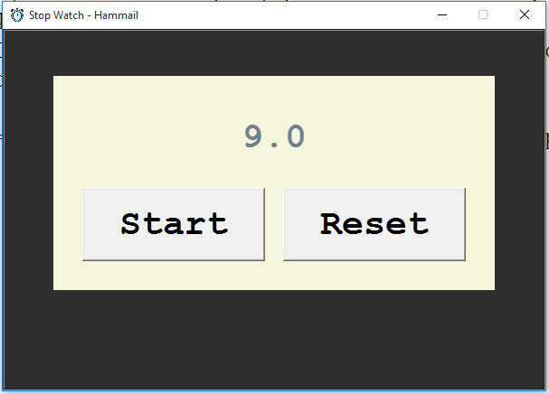

# 🕒 Stop Watch - Hammail

A simple and elegant stopwatch application built using Python's `tkinter` GUI library. This app allows users to **start**, **stop**, and **reset** a timer with a clean and visually appealing interface.

 <!-- Replace with actual screenshot if you add one -->

---

## 🔧 Features

- Start and stop timer functionality
- Reset to zero
- Clean and minimal GUI using `tkinter`
- Accurate to one decimal place
- Lightweight and easy to run
- Customizable appearance with themed colors

---

## 📁 Project Structure

```
stopwatch/
├── icon.png            # App icon
├── stopwatch.py        # Main Python script
└── README.md           # This file
```

---

## 🚀 Getting Started

### Prerequisites

- Python 3.x installed on your system

### Installation

1. Clone the repository first.
  

2. Run the app:
   ```bash
   python stopwatch.py
   ```

---

## 🖼️ App UI

- **Main Window**: Displays elapsed time in seconds.
- **Start/Stop Button**: Toggles the stopwatch.
- **Reset Button**: Resets the timer to zero.
- **Icon**: Custom app icon (`icon.png`).

> Note: If the icon is not found or causes an error, either replace it or remove the line that sets the icon in `main.py`.

---

## 💻 Code Overview

The stopwatch logic is handled with a few key variables:

- `running`: A boolean to track if the stopwatch is active.
- `start_time`: Timestamp of the last start.
- `elapsed_time_at_stop`: Total time recorded before the most recent start.

Timer updates are handled using `root.after()` for smooth updates every 100 milliseconds.

---

## 🛠 Customization

You can change the app appearance by editing these variables at the top of `stopwatch.py`:

```python
font = "Courier 30 bold"
app_bg = "#2E2E2E"
main_frame_bg = "#F5F5DC"
```

Feel free to update fonts, colors, and window size to suit your style.

---

## 📃 License

This project is licensed under my custum License. See the [LICENSE](License.txt) file for details.

---

## 🙌 Acknowledgments

- Developed by Hammail
- Built using the Python `tkinter` GUI library
